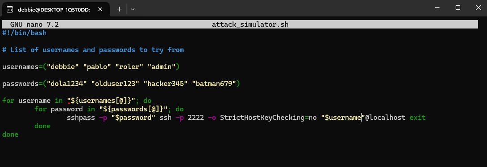
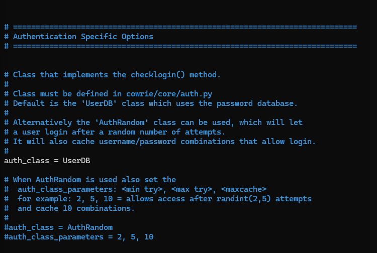
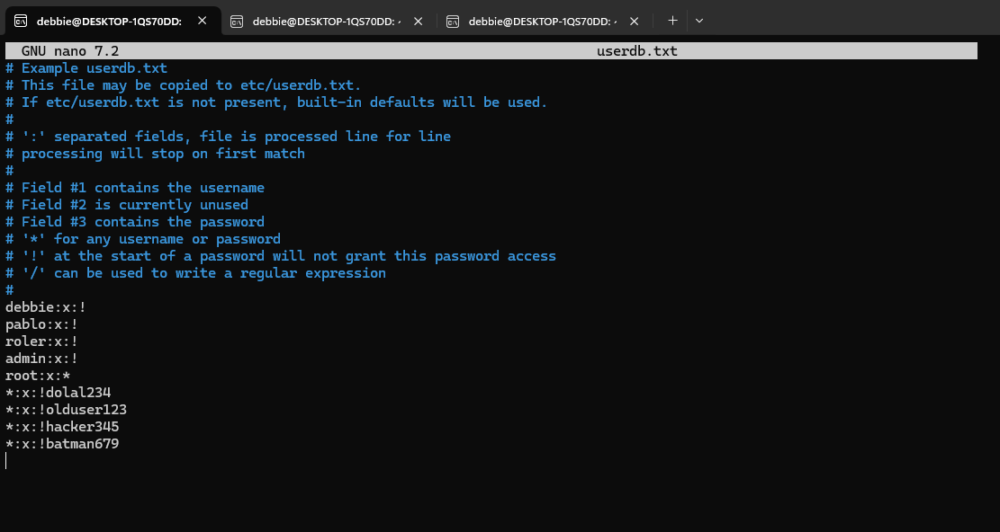
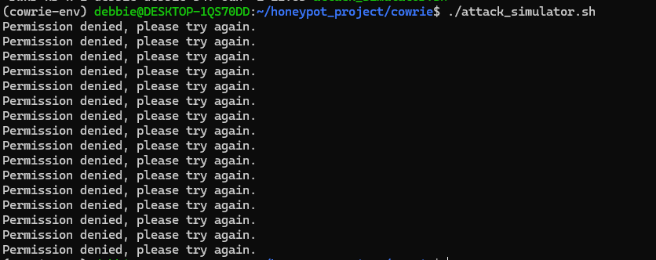
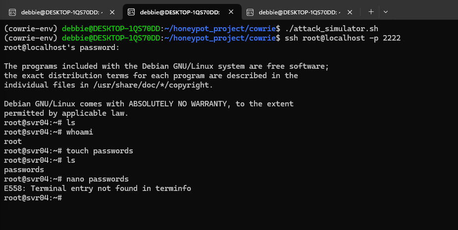
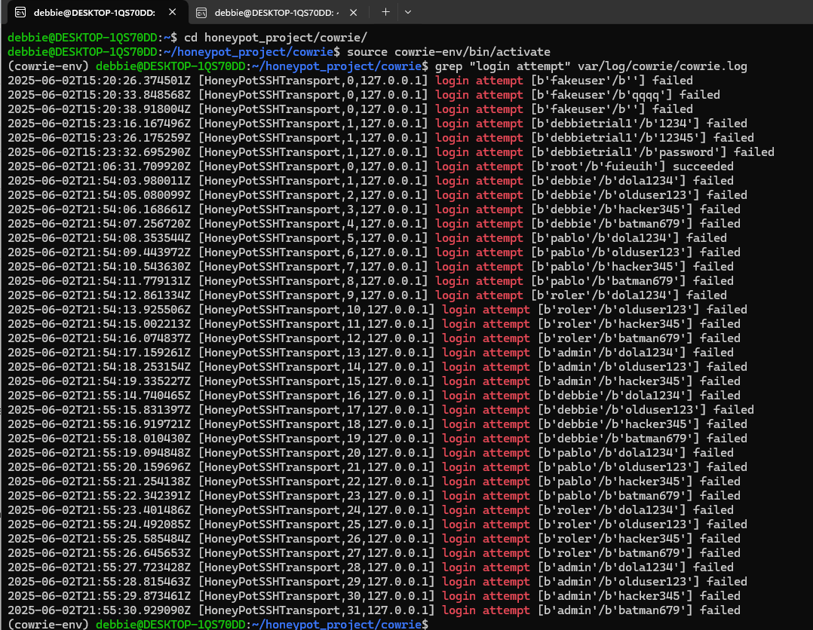
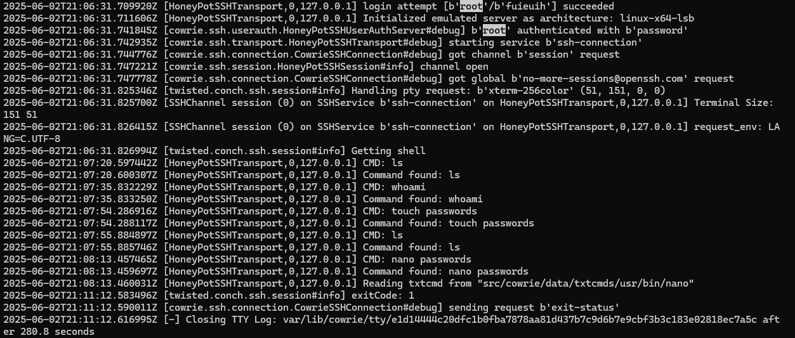

# HONEYPOT PROJECT

This project uses [Cowrie](https://github.com/cowrie/cowrie), a medium-interaction SSH/Telnet honeypot designed to simulate vulnerable systems and monitor attacker behavior. The goal is to understand how attackers operate by simulating brute-force login attempts and analyzing system logs.

> ⚠️ **Note:** This honeypot was not exposed to the internet. All attacks were simulated locally for ethical and security reasons.

---

## Requirements

- Python 3
- Git
- Virtual environment (`venv`)
- Bash (for scripting)

---

## STEP 1: Clone and Set Up Cowrie

Command used:

`git clone https://github.com/cowrie/cowrie.git`
`cd cowrie`
`python3 -m venv cowrie-env`
`source cowrie-env/bin/activate`
`pip install --upgrade pip`
`pip install -r requirements.txt`
`cp etc/cowrie.cfg.dist etc/cowrie.cfg`

## STEP 2: Start cowrie

Command used: `bin/cowrie start`

## STEP 3: View logs

Command used: `cat var/log/cowrie/cowrie.json` 

This gave me no output because my honeypot was not accessible on the web for actual attackers

## STEP 4: Simulate an attack with bash

Command used: `touch attack_simulator.sh`

In the script screenshot below I created a bash array of various usernames and passwords to attempt logins using a for loop

Make script executable 

Command used: `chmod +x attack_simulator.sh`

## STEP 5: Configure Access Control
To block or allow specific login attempts, I edited the UserDB file specified in Cowrie’s config

Command used: `nano etc/cowrie.cfg`

I found the file path in the README of Cowrie and renamed the example file

Command used: `mv userdb.example userdb.txt`

From the comments of this file I was able to understand that it was written in the format `username:x:password` and I ensured that none of the usernames or passwords from my script were allowed and that only the user `root` was able to gain access with any password.

 

Run attack script

Command used: `./attack_simulator.sh`

## STEP 6: Simulate a Successful Login

Using the username `root` and any password of my choice I was able to gain access and perform some basic tasks however it was limited as Cowrie does not support full terminal editors

## STEP 7: Analyze the Logs 

To inspect login attempts

Command used: `grep "login attempts" var/log/cowrie/cowrie.log`

To analyze a specific attempt by the root user 

Command used: `less var/log/cowrie/cowrie.log`

Then search for

Command used: `/root`

# Conclusion

This project helped me:

- Understand how SSH honeypots work

- Simulate and monitor brute-force attacks

- Analyze system logs to track attacker behavior

- Gain hands-on cybersecurity experience in a safe environment
